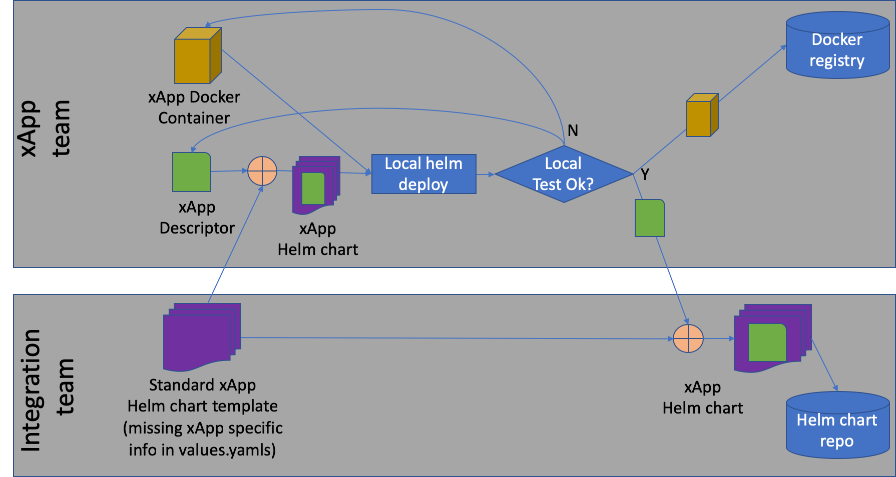

.. This work is licensed under a Creative Commons Attribution 4.0 International License.
.. http://creativecommons.org/licenses/by/4.0
..
.. Copyright (C) 2019 AT&T Intellectual Property

Developer-Guide
===============

.. contents::
   :depth: 3
   :local:

Overview
---------

The introduction of a new xApp to Near Realtime RIC consists of a number of steps:

1. xApp developer implements the xApp and packaging into a docker container;
2. xApp developer creates a "descriptor" for the xApp describing how it can be configured;
3. the xApp developer generates a testing Helm chart using tools provided in this repo and test xApp in a Kubernetes/Helm environment;
4. the xApp developer submits the xApp "descriptor" along with the container image for on-boarding.

At deployment time, the descriptor and the container image of an already on-boarded xApp are applied to a standard Helm chart for the generation of the Helm chart for the xApp.  Such Helm chart is pushed to the private Helm repository of the xApp Manager of the Near Realtime RIC Platform.  

The image below depicts this workflow.

xApp Descriptor
---------------
An xApp's descriptor consists of two files, a config-file.json file and a schema.json file which provides the schema definition of the config-file.json file.  

An example pair of config and schema files can be found at the ric-app/admin repo, under its init directory:
https://gerrit.o-ran-sc.org/r/gitweb?p=ric-app/admin.git;a=tree;f=init;hb=HEAD

Generating Helm Charts
----------------------
The ric-xapp/bin/install script is provided for generating the xApp Helm chart.

The scrip will insert the xApp descriptor files into the standard xApp helm chart template, package it, and upload it to a Helm repository.

Prerequisites:
- config-file.json file from the xApp descriptor;
- schema.json file from the xApp descriptor;
- full path with tag of the docker image of the xApp;
- a recipe file that contains the full URL of the helm repo;
- username and password of the helm repo.

Parameters:

+------------+----------------------------------------------------+
| option     | Description                                        |
+============+====================================================+ 
|-n          |name of the xApp                                    |
+------------+----------------------------------------------------+
|-v          | version of the helm chart                          |
+------------+----------------------------------------------------+ 
|-f          | path of the recipe that contains the helm repo URL |
+------------+----------------------------------------------------+ 
|-I          | full docker image path                             |
+------------+----------------------------------------------------+
|-d          | path to the schema.json file                       |
+------------+----------------------------------------------------+
|-c          | path to the config-file.json file                  |
+------------+----------------------------------------------------+
|-h          | helm repo username                                 |
+------------+----------------------------------------------------+
|-p          | helm repo password                                 |
+------------+----------------------------------------------------+

Below is an example of the recipe file that specifies the Helm repo parameters:
::

  global:
    # Docker registry from which RIC platform components pull the images
    repository: nexus3.o-ran-sc.org:10004
    # Name of the K8S docker credential that is onboarded by 20-credential
    repositoryCred: docker-reg-cred
    # Docker image pull policy
    imagePullPolicy: Always
    # Helm repo that will be used by xApp manager
    helmRepository: "https://helm-entry"
    # Certificate of the helm repo
    helmRepositoryCert: xapp-mgr-certs
    # Name of the K8S secret that contains the credential of the helm repo
    helmRepositoryCred: xapp-mgr-creds
    # The name of the tiller that xApp helm client talks to
    

The resultant Helm chart is available at /tmp/{{chart-name}}-{{chart-version}}.tgz.  This file can be uploaded yo Helm chart using an API call that the Helm chart repo supports.  For example, the following command applies to a Chart Museum type of Helm repo:
::

  curl -Lk -u $HELM_REPO_USERNAME:$HELM_REPO_PASSWORD "$HELM_REPO"/api/charts --data-binary "@/tmp/$CHART_NAME-$CHART_VERSION.tgz"

